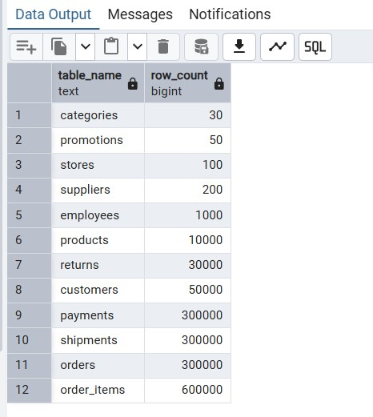
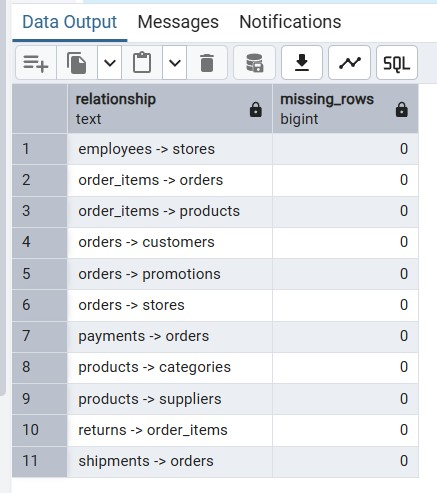
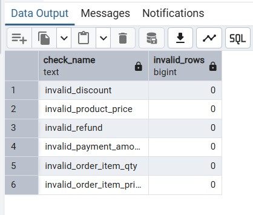

# Insights

## Data Quality Checks

Initial data quality checks were performed after loading the retail dataset into PostgreSQL.

The validation included:

- Row count checks for all 12 tables
- Missing foreign key reference checks
- Invalid numeric value checks

## Row Count Validation

All 12 dataset tables were successfully loaded into PostgreSQL.

## Relationship Validation

Foreign key relationships were checked using `LEFT JOIN` queries.

The goal was to identify records in child tables that reference missing records in parent tables.

Checked relationships included:

- orders -> customers
- orders -> stores
- orders -> promotions
- order_items -> orders
- order_items -> products
- products -> categories
- products -> suppliers
- payments -> orders
- shipments -> orders
- returns -> order_items
- employees -> stores

No missing foreign key references were found.

## Invalid Numeric Values

The dataset was also checked for invalid numeric values, including:

- non-positive item quantities
- non-positive item prices
- non-positive product prices
- negative payment amounts
- negative refunds
- negative discounts

No invalid numeric values were found.

## Summary

The initial data quality checks confirmed that the dataset was successfully loaded and is ready for further SQL analysis.