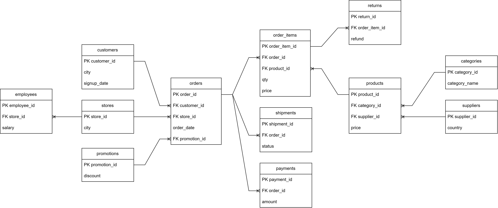

# Table overview

This document describes the main tables in the Retail SQL Analytics project and the expected relationships between them.

The dataset contains 12 CSV files representing a retail data warehouse. The project focuses mainly on sales, customers, products, payments, shipments, returns, stores, categories, suppliers, and promotions.

## Tables
* categories - product categories
* customer - customer information
* employees - employee information
* order_items - products inside each order: product, quantity, price
* orders - order-level data: order_id, customer_id, store_id, date, promotion_id
* payments - payment amount for each order
* products - product data: category, supplier, price
* promotions - discount information
* returns - return order items and refund amounts
* shipments - shipment status for each order
* stores - store information by city
* suppliers - supplier information by country 

## Database Schema
